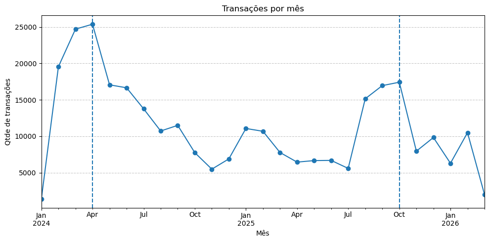
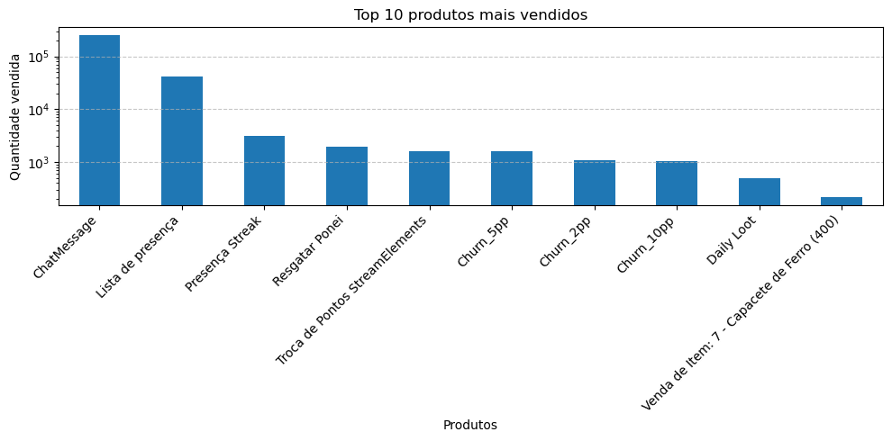
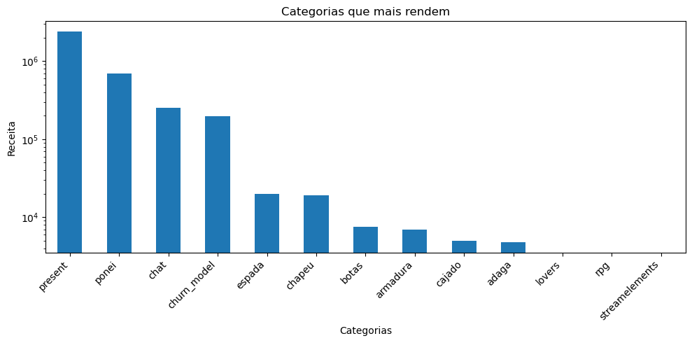
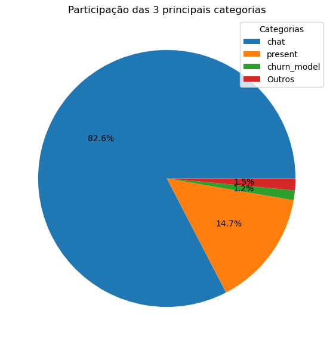

# 📊 Análise de Transações de Usuários

<p align="center">
    
</p>

## 🔎 Resumo da Análise

- **98,5% do volume de uso** está concentrado em apenas **3 categorias**
- **ChatMessage** é o produto mais utilizado da plataforma
- As categorias **present** e **ponei** concentram maior geração de pontos
- **Lançamentos de cursos** geram picos claros de atividade

---

## 📌 Sobre o Projeto

Este projeto apresenta uma **Análise Exploratória de Dados (EDA)** sobre transações realizadas por usuários em uma plataforma de interação de um criador de conteúdo focado em educação em dados.

O objetivo da análise é entender padrões de uso, geração de receita e comportamento da comunidade ao longo do tempo.

---

## 🎯 Objetivos da Análise

Entre os principais objetivos desta análise estão:

- identificar os **produtos mais utilizados pelos usuários**
- analisar **quais categorias geram maior receita**
- entender a **distribuição de uso entre categorias**
- avaliar o **valor médio das transações**
- analisar a **evolução das transações ao longo do tempo**
- identificar **picos de atividade associados a eventos externos**

---

## 🗂 Estrutura do Projeto

```text
analise-transacoes-usuarios/
│
├── data/
│   └── raw/
│       ├── clientes.csv
│       ├── produtos.csv
│       ├── transacoes.csv
│       └── transacao_produto.csv
│
├── images/
│   ├── top10.png
│   ├── categorias.png
│   ├── porcentagem.png
│   └── mes.png
│
├── sql/
│   ├── 01_exploracao.sql
│   ├── 02_joins.sql
│   ├── 03_metricas.sql
│   └── 04_base_analitica.sql
│
├── notebooks/
│   └── analise_transacoes.ipynb
│
└── README.md
```

---

## 🛠 Tecnologias Utilizadas

- SQL
- Python
- Pandas
- Matplotlib
- Jupyter Notebook

---

## 🔎 Etapas da Análise

A análise foi realizada em três etapas principais:

### 1️⃣ Exploração dos dados em SQL

Nesta etapa foram realizadas consultas para:

- explorar a estrutura das tabelas
- realizar `JOIN` entre as tabelas
- calcular métricas iniciais como:
  - produtos mais vendidos
  - receita por categoria
  - clientes com maior número de transações

---

### 2️⃣ Construção da base analítica

Foi criada uma base consolidada combinando:

- transações
- produtos
- categorias
- quantidades e valores

Essa base foi utilizada como base principal para as análises em Python.

---

### 3️⃣ Análise exploratória com Python

Utilizando **pandas**, foram realizadas análises como:

- produtos mais vendidos
- receita por categoria
- valor médio das transações
- distribuição de uso entre categorias
- evolução temporal das transações

Com **matplotlib**, foram criados gráficos para visualizar os principais padrões encontrados.

---

## 📊 Principais Insights

### 1️⃣ Volume de uso ≠ geração de receita

Embora **ChatMessage** seja o produto mais utilizado na plataforma, ele não é o principal gerador de receita.

As categorias **present** e **ponei** apresentam maior geração de pontos, indicando que itens de menor frequência podem ter maior valor financeiro por transação.

---

### 2️⃣ Forte concentração de uso em poucas categorias

A análise mostrou que **apenas três categorias representam aproximadamente 98,5% de todo o volume de uso da plataforma**, indicando forte concentração do comportamento dos usuários.

---

### 3️⃣ Itens premium apresentam maior valor médio por transação

Produtos relacionados a **equipamentos e itens especiais** apresentam valores médios significativamente maiores, caracterizando itens com perfil **premium**.

---

### 4️⃣ Lançamentos de cursos geram picos de atividade

A análise temporal revelou picos de atividade que coincidem com **datas de lançamento de novos cursos**, sugerindo forte impacto desses eventos no engajamento dos usuários.

---

## 📈 Exemplos de Visualizações

O projeto inclui gráficos como:

### Top 10 produtos mais utilizados


### Receita por categoria


### Participação percentual das categorias


### Evolução das transações ao longo do tempo


---

## ▶️ Como reproduzir

1. Clone este repositório
2. Abra os arquivos `.sql` para explorar as consultas
3. Execute o notebook `notebooks/analise_transacoes.ipynb`
4. Instale as bibliotecas necessárias:
   - pandas
   - matplotlib
   - jupyter

---

## 📚 Aprendizados

Este projeto permitiu praticar:

- consultas SQL com **JOIN e agregações**
- manipulação de dados com **pandas**
- análise exploratória de dados (**EDA**)
- criação de **visualizações com matplotlib**
- interpretação de dados e geração de insights

---

## 🚀 Possíveis Extensões

Algumas análises que poderiam ser exploradas em etapas futuras:

- análise de **concentração de receita por cliente (Pareto 80/20)**
- análise de **retenção de usuários**
- análise de **sazonalidade mais detalhada**
- construção de **dashboard interativo**

---

## 👨‍💻 Autor

Desenvolvido por João como parte dos estudos em Análise de Dados.